# OmniCalc & Time Service Suite


>[!IMPORTANT] 
> Данный проект представляет собой экосистему из двух
> независимых микросервисов, объединенных через Nginx Reverse 
> Proxy. Система демонстрирует продвинутые принципы ООП на C++, 
> работу с асинхронными HTTP-запросами, контейнеризацию и 
> персистентное хранение данных в PostgreSQL.


## Архитектура

```
laba_10/
├── services/
│   ├── math-service/            # Микросервис математических вычислений
│   │   ├── domain/              # Модели (Rational, Complex, Pair)
│   │   ├── service/             # Бизнес-логика
│   │   ├── controller/          # REST API (httplib)
│   │   ├── repository/          # Логирование операций в БД
│   │   ├── CMakeLists.txt
│   │   └── Dockerfile
│   ├── time-service/            # Микросервис управления временем
│   │   ├── domain/              # Модель Time (нормализация, валидация)
│   │   ├── service/             # Логика работы с репозиторием
│   │   ├── repository/          # Слой доступа к PostgreSQL (libpqxx)
│   │   ├── controller/          # API эндпоинты
│   │   └── Dockerfile
│   └── web-ui/                  # Frontend (Vue 3 + Nginx)
├── docker-compose.yml           # Оркестрация всей системы
└── nginx/                       # Конфигурация Reverse Proxy
```

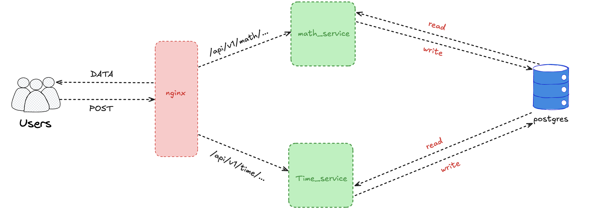

## Схема базы данных

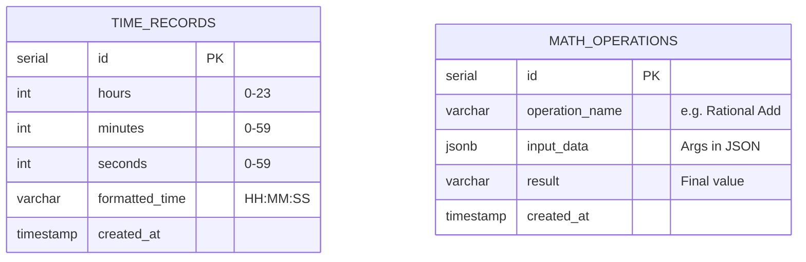

## Какие бывают запросы

> [!TIP]
> ### Площадь кольца `GET`
> 
> 200 OK <- сервер принял данные и произвел расчет
> ```shell
> curl "http://localhost:8080/api/math/ring?outer=10&inner=5"
> ```
> ответ:
> ```json
> {
> "area" : 235.619449
> }
> ```
> 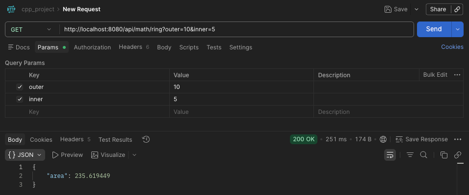
>
> ### Калькулятор комплексных чисел `GET`
> 
> 200 OK <- сервер принял данные и произвел расчет
> 
> **Сложение(add)**
> 
> ```shell
> curl "http://localhost:8080/api/math/complex/calc?re1=2.5&im1=1.0&re2=3.0&im2=2.0&op=add"
> ```
> 
> **Вычитание(sub)**
>
> ```shell
> curl "http://localhost:8080/api/math/complex/calc?re1=2.5&im1=1.0&re2=3.0&im2=2.0&op=add"
> ```
> 
> **Умножение(mul)**
>
> ```shell
> curl "http://localhost:8080/api/math/complex/calc?re1=2.5&im1=1.0&re2=3.0&im2=2.0&op=add"
> ```
> 
> **Деление(div)**
>
> ```shell
> curl "http://localhost:8080/api/math/complex/calc?re1=2.5&im1=1.0&re2=3.0&im2=2.0&op=add"
> ```
> 
> **Сравнение на равенство(eq)**
>
> ```shell
> curl "http://localhost:8080/api/math/complex/calc?re1=2.5&im1=1.0&re2=3.0&im2=2.0&op=add"
> ```
> 
> **Сравнение на неравенство(neq)**
>
> ```shell
> curl "http://localhost:8080/api/math/complex/calc?re1=2.5&im1=1.0&re2=3.0&im2=2.0&op=add"
> ```
> 
> 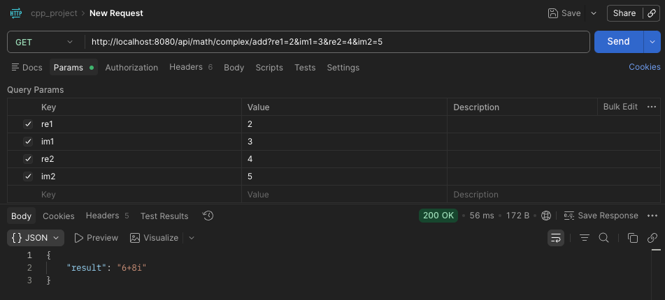
>
> ### Калькулятор рациональных чисел `GET`
> 
> 200 OK <- сервер принял две дроби и произвел расчеты
> 
> **Сложение(add)**
> ```shell
> curl "http://localhost:8080/api/math/rational/calc?num1=1&den1=2&num2=1&den2=3&op=add"
> ```
>
> **Сложение(add)**
> ```shell
> curl "http://localhost:8080/api/math/rational/calc?num1=1&den1=2&num2=1&den2=3&op=add"
> ```
>
> **Вычитание(sub)**
> ```shell
> curl "http://localhost:8080/api/math/rational/calc?num1=1&den1=2&num2=1&den2=3&op=sub"
> ```
>
> **Деление(div)**
> ```shell
> curl "http://localhost:8080/api/math/rational/calc?num1=1&den1=2&num2=1&den2=3&op=div"
> ```
> 
> 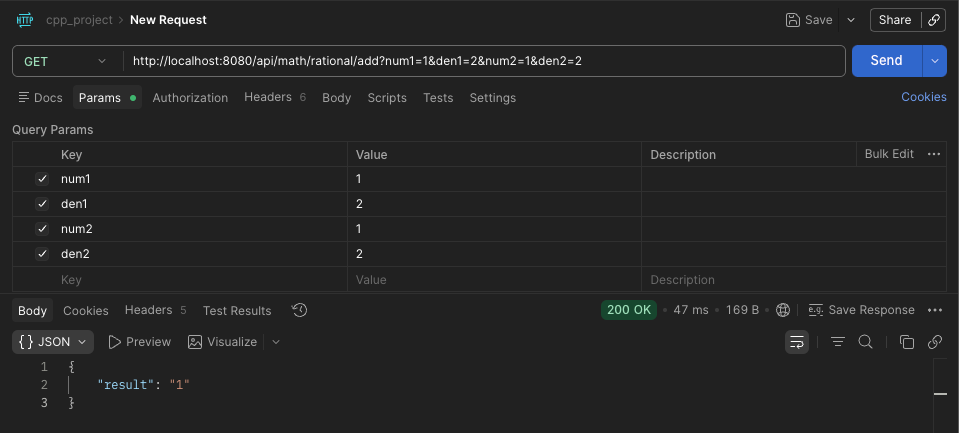
>
> ### Площадь треугольника `GET`
> 
> 200 OK <- сервер принял данные и произвел расчет площади
> ```shell
> curl "http://localhost:8080/api/math/triangle/area?a=3.0&b=4.0&c=5.0"
> ```
> ответ:
> ```json
> {
> "area" : "2.9047038"
> }
> ```
> 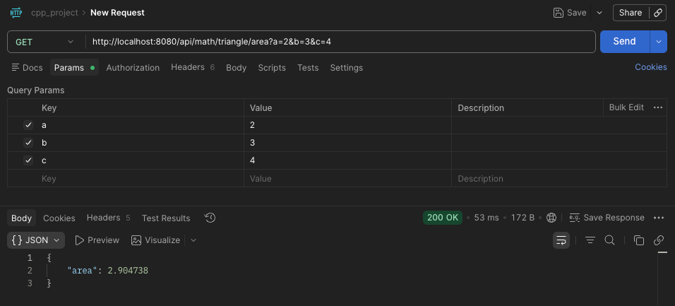
>
> ### История мат операций `GET`
> 
> ```shell
> curl "http://localhost:8080/api/math/history"
> ```
> 
> ### Полярные координаты комплексного числа `GET`
> 
> ```shell
> curl "http://localhost:8080/api/math/complex/polar?re=3.0&im=4.0"
> ```

## Теперь как не надо

>[!CAUTION]
> 400 (Bad Request) <- **какое-то из полей пустое**
> 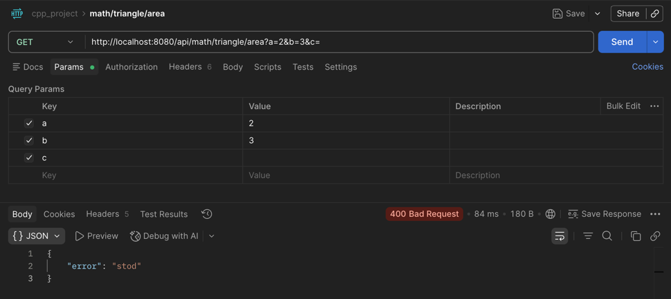
> 
> 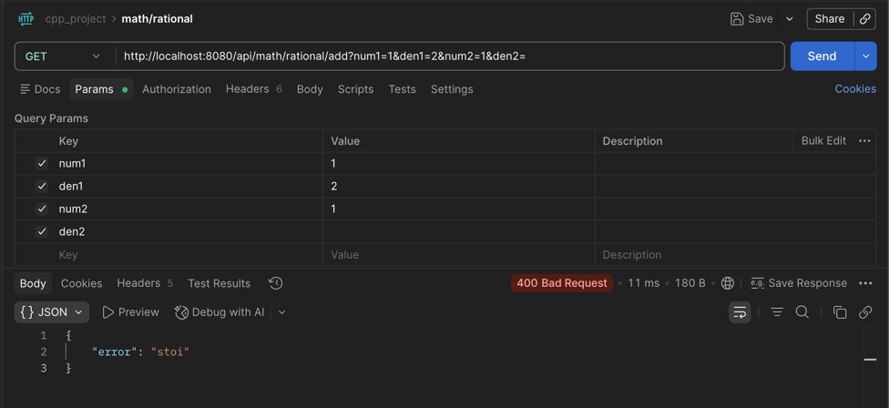
> 
> 
> 
> 400 (Bad Request) <- **неправильный формат ввода**
> 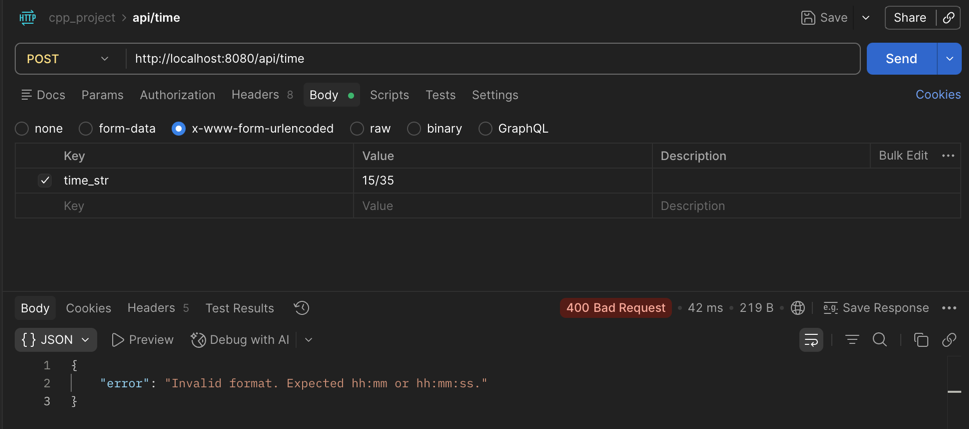
> 
> 400 (Bad Request) <- **деление на ноль**
> 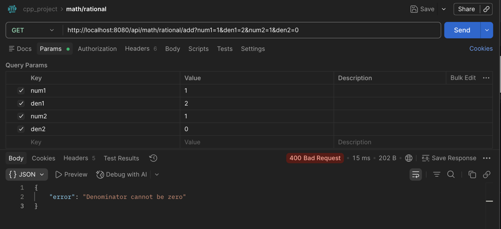
> 
> 500 (Internal Server Error) <- **мне было лень обрабатывать это**
> 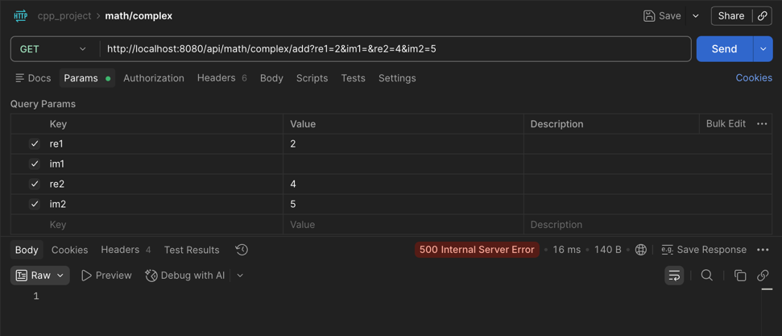
> 
> 400 (Bad Request) <- **радиус не может быть отрицательным**
> 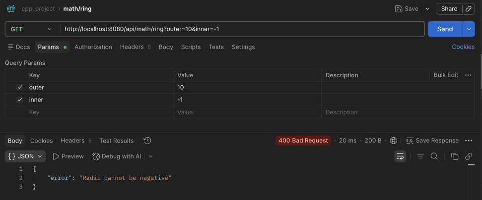
>

## Настйрока окружения

>[!IMPORTANT]
> В корне проекта у нас есть **.env.example**
> 
> ```env
> #Settings database(Postgres)
> DB_HOST=postgres
> DB_PORT=5432
> DB_USER=default_user
> DB_PASSWORD=default_password
> DB_NAME=default_db
>
> #Service settings
> TIME_SERVICE_PORT=8081
> MATH_SERVICE_PORT=8082
> WEB_UI_PORT=8080
> ```
> 
> просто замените заглушки на реальные значения и переведите в формат **.env**

## Запуск
>[!IMPORTANT]
>  **Запуск через докер**
> ```shell
> cd infrastructure
> docker compose up -d --build
> ```
> 
> **Вот так можно посмотреть БДшку**
> ```shell
> export PGPASSWORD="your pass in .env for pass_pg"                                                 
> psql -h localhost -p 5432 -U admin -d postgres
> ```
> 
> потом
> 
> ```shell
> \c laba_db
> ```
> 
> для проверки там ли вы, можно сделать так
> 
> ```shell
> \dt
> ```
> 
> вы увидите
> 
> 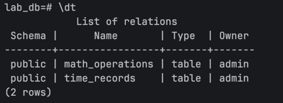
> 
> Получаем все данные из time_service
> 
> ```sql
> SELECT * FROM time_service;
> ```
> 
> 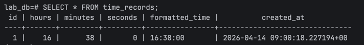
> 
> Получаем все данные из math_service
> 
> ```sql
> SELECT * FROM math_service;
> ```
> 
> 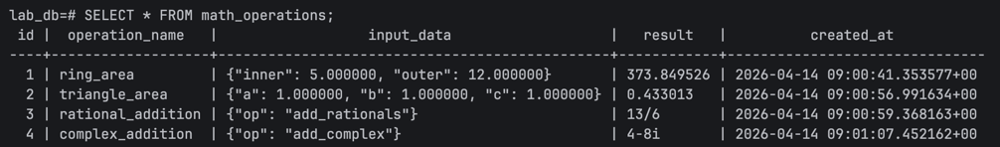


---
**by finnik**