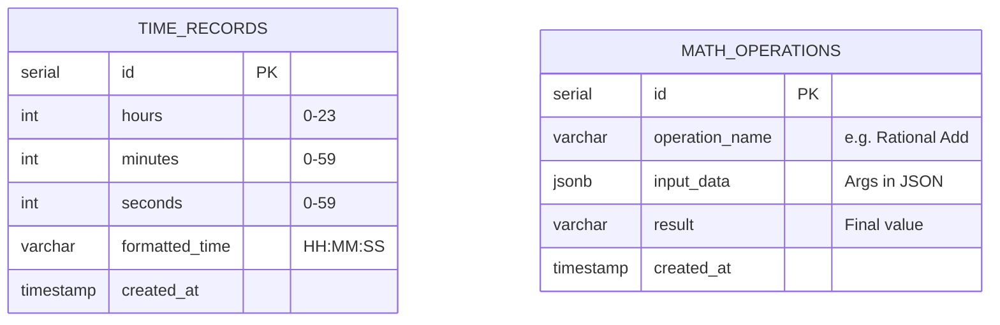

# OmniCalc & Time Service Suite


>[!IMPORTANT] 
> Данный проект представляет собой экосистему из двух
> независимых микросервисов, объединенных через Nginx Reverse 
> Proxy. Система демонстрирует продвинутые принципы ООП на C++, 
> работу с асинхронными HTTP-запросами, контейнеризацию и 
> персистентное хранение данных в PostgreSQL.


## Архитектура

```
laba_10/
├── services/
│   ├── math-service/            # Микросервис математических вычислений
│   │   ├── domain/              # Модели (Rational, Complex, Pair)
│   │   ├── service/             # Бизнес-логика
│   │   ├── controller/          # REST API (httplib)
│   │   ├── repository/          # Логирование операций в БД
│   │   ├── CMakeLists.txt
│   │   └── Dockerfile
│   ├── time-service/            # Микросервис управления временем
│   │   ├── domain/              # Модель Time (нормализация, валидация)
│   │   ├── service/             # Логика работы с репозиторием
│   │   ├── repository/          # Слой доступа к PostgreSQL (libpqxx)
│   │   ├── controller/          # API эндпоинты
│   │   └── Dockerfile
│   └── web-ui/                  # Frontend (Vue 3 + Nginx)
├── docker-compose.yml           # Оркестрация всей системы
└── nginx/                       # Конфигурация Reverse Proxy
```


## Схема базы данных



## Какие бывают запросы

> [!TIP]
> 200 OK <- сервер принял данные и произвел расчет
> ```shell
> curl 
> ```
> ответ:
> ```json
> {
> "area" : 235.619449
> }
> ```
> 
> 
> 200 OK <- сервер принял данные и произвел расчет
> ```shell
> curl 
> ```
> ответ:
> ```json
> {
> "result" : "6+8i"
> }
> ```
> 
> 
> 200 OK <- сервер принял две дроби и произвел расчеты
> ```shell
> curl 
> ```
> ответ:
> ```json
> {
> "result" : "1"
> }
> ```
> 
> 
> 
> 200 OK <- сервер принял данные и произвел расчет площади
> ```shell
> curl 
> ```
> ответ:
> ```json
> {
> "area" : "2.9047038"
> }
> ```
> 
> 

## Теперь как не надо

>[!CAUTION]
> 400 (Bad Request) <- **какое-то из полей пустое**
> 
> 
> 
> 
> 
> 
> 400 (Bad Request) <- **неправильный формат ввода**
> 
> 
> 400 (Bad Request) <- **деление на ноль**
> 
> 
> 500 (Internal Server Error) <- **мне было лень обрабатывать это**
> 
> 
> 400 (Bad Request) <- **радиус не может быть отрицательным**
> 
>

## Запуск
>[!IMPORTANT]
>  **Запуск через докер**
> ```shell
> cd infrastructure
> docker compose up -d --build
> ```
> 
> **Вот так можно посмотреть БДшку**
> ```shell
> пока лень писать сорр
> ```


---
**by finnik**